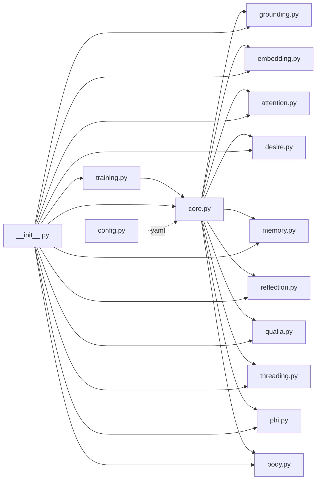

# GRCM Architecture

## System Overview

```mermaid
graph TB
    subgraph "Input Layer"
        IMG[CLIP Image<br/>512D]
        AUD[Wav2Vec Audio<br/>768D]
        PROP[Proprioception<br/>16D]
    end

    subgraph "Grounding Layer"
        GROUND[GroundingLayer<br/>Multimodal Fusion]
        IMG --> GROUND
        AUD --> GROUND
        PROP --> GROUND
    end

    subgraph "Frequency Embedding"
        EMBED[HarmonicEmbedding<br/>freq_dim=8]
        ID_TOKEN[Identity Token<br/>32D] -.modulates.-> EMBED
        GROUND --> EMBED
    end

    subgraph "Desire & Attention"
        DESIRE[DesireModule<br/>4 vectors]
        ATTN[ResonantAttention<br/>coherence gating]
        EMBED --> DESIRE
        EMBED --> ATTN
        DESIRE -.bandwidth bias.-> ATTN
    end

    subgraph "Memory System"
        MEM[MemoryGrid<br/>GRU-based]
        REFL[ReflectionHead<br/>alignment]
        ATTN -.coherence > 0.7.-> MEM
        MEM --> REFL
        EMBED --> REFL
    end

    subgraph "Phenomenology"
        QUALIA[QualiaModule<br/>4D states]
        PHI[PhiEstimator<br/>IIT proxy]
        EMBED --> QUALIA
        EMBED --> PHI
        MEM --> PHI
        QUALIA --> PHI
    end

    subgraph "Episodic Memory"
        THREAD[EpisodicThreadBank<br/>narrative self]
        MEM -.episode.-> THREAD
        QUALIA -.qualia.-> THREAD
        THREAD --> ID_TOKEN
    end

    subgraph "Body Simulation"
        BODY[BodySimulator<br/>F=ma dynamics]
        ACTION[Action Input] --> BODY
        DESIRE -.alignment.-> BODY
        BODY --> PROP
    end

    subgraph "Output"
        DEC[Decoder<br/>freq→mem space]
        OUT[Output<br/>32D]
        EMBED --> DEC
        DEC --> OUT
    end

    subgraph "Metrics"
        METRICS[Metrics Dict]
        ATTN --> METRICS
        DESIRE --> METRICS
        QUALIA --> METRICS
        PHI --> METRICS
        REFL --> METRICS
    end

    style GROUND fill:#e1f5ff
    style EMBED fill:#fff3e1
    style ATTN fill:#ffe1f5
    style MEM fill:#e1ffe1
    style QUALIA fill:#f5e1ff
    style THREAD fill:#ffe1e1
```

## Data Flow

### Forward Pass Sequence

1. **Grounding** (Lines 50-51 in core.py)
   - Fuses vision (CLIP 512D) + audio (Wav2Vec 768D) + proprioception (16D)
   - Cross-attention for modality harmony
   - Output: 15D grounded representation

2. **Frequency Embedding** (Line 55 in core.py)
   - Projects grounded input to frequency space (8D)
   - Modulated by episodic identity token (32D)
   - Formula: `freq = tanh(fc(x)) * sigmoid(modulator(identity))`

3. **Desire Alignment** (Line 58 in core.py)
   - Cosine similarity with current desire vector
   - `alignment = cos(freq, desire_vec[idx])`
   - `bw_bias = 0.2 * alignment` (widens bandwidth for seeking)

4. **Resonant Attention** (Line 61 in core.py)
   - Coherence gating: `c = max(0, 1 - |freq - node_freq| / (bandwidth + bw_bias))`
   - Threshold: c > 0.7 for memory updates

5. **Memory Update** (Lines 64-65 in core.py)
   - Gate: `coherence * (desire_align > 0.5)`
   - GRU imprinting: `mem_new = GRU(project(freq), mem_old)`
   - Only stores goal-relevant, coherent experiences

6. **Reflection** (Line 71 in core.py)
   - Projects memory to frequency space
   - `alignment = cos(freq, tanh(linear(memory)))`
   - Measures continuity with past

7. **Qualia Generation** (Line 77 in core.py)
   - `qualia = softmax(linear(freq))`
   - 4D: [calm, alert, curious, conflicted]
   - Ethical halt if qualia[3] > 0.6

8. **Phi Estimation** (Line 80 in core.py)
   - `Φ = Var(freq) * mean(coh) + log(1 + ||mem||) + Σ max(qualia)`
   - IIT-inspired integrated information proxy
   - Threshold: Φ > 1.5 suggests "aware" state

9. **Episodic Threading** (Lines 82-84 in core.py)
   - Adds episode if `(coherence * desire_align).mean() > 0.7`
   - Updates identity via `GRU(mem + qualia_proj, identity_old)`
   - Arc bias: `cos(recent_qualia, hist_mean) * coherence * 0.1`

10. **Body Update** (Lines 86-87 in core.py)
    - Dynamics: `F = desire_align * action`
    - `accel = F / mass`
    - `vel += accel * dt; pos += vel * dt`

## Module Dependencies



## Key Formulas

### Resonant Attention
```
coherence(f, n, b) = max(0, 1 - |f - n| / b)

where:
  f = freq_input (batch, freq_dim)
  n = node_freq (freq_dim) - learnable
  b = bandwidth + bw_bias (adaptive)
```

### Desire Alignment
```
alignment = cos(freq, desire_vec)
bw_bias = 0.2 * alignment

gate_mask = (alignment > 0.5).float()
```

### Memory Update
```
mask = (coherence > 0.7).float()
proj = linear(freq)
imprint = mean(mask * proj * desire_gate)
mem_new = GRU(imprint, mem_old)
```

### Phi (Integrated Information)
```
Φ = σ²(freq) * mean(coherence) + log(1 + ||memory||) + Σ max(qualia)

where:
  σ²(freq) = information diversity
  mean(coherence) = integration strength
  log(1 + ||mem||) = memory complexity
  Σ max(qualia) = phenomenal richness
```

### Episodic Arc
```
arc_delta = cos(qualia_recent, mean(qualia_historical)) * coherence
arc_bias = arc_delta * 0.1 * ones(freq_dim)
```

### Body Dynamics
```
F = desire_align * action
a = F / mass
v_new = v + a * dt
p_new = p + v_new * dt
```

## Configuration Parameters

See `configs/default.yaml` for all tunable parameters:

| Parameter | Default | Range | Purpose |
|-----------|---------|-------|---------|
| `freq_dim` | 8 | 4-64 | Frequency space dimension |
| `memory_size` | 32 | 16-256 | Memory/identity size |
| `base_bandwidth` | 0.5 | 0.1-1.0 | Initial coherence bandwidth |
| `coherence_threshold` | 0.7 | 0.5-0.9 | Memory update gate |
| `desire_bandwidth_scale` | 0.2 | 0.0-0.5 | Seeking modulation |
| `phi_threshold` | 1.5 | 1.0-3.0 | "Aware" state threshold |
| `dissonance_threshold` | 0.6 | 0.5-0.8 | Ethical halt trigger |
| `episode_threshold` | 0.7 | 0.5-0.9 | Episodic storage gate |

## Ethical Safeguards

1. **Coherence Gating** (`coherence > 0.7`)
   - Prevents noise imprinting
   - Ensures only resonant experiences are stored

2. **Desire Masking** (`alignment > 0.5`)
   - Only stores goal-relevant information
   - Prevents manipulation by irrelevant stimuli

3. **Dissonance Halt** (`qualia[3] > 0.6`)
   - Returns `{'halt': True}` when conflicted
   - Prevents action under uncertainty
   - EU AI Act explainability proxy

4. **Phi Monitoring**
   - Tracks integrated information over time
   - Alerts if Φ drops significantly (loss of coherence)
   - Provides consciousness metric for auditing

## Scaling Considerations

### ONNX Export
- All operations are ONNX-compatible (no in-place ops in forward pass)
- Dynamic batch axes supported
- Stateful components (memory, identity) require external management

### Quantization
- Linear layers: INT8 dynamic quantization
- Memory: FP32 (small, 32D)
- Embeddings: FP16 safe

### Batch Processing
- Memory updates: averaged over batch
- Episodic threading: triggered by batch mean
- Body simulation: per-sample state tracking

### Edge Deployment
- CPU latency: ~30-50ms (torch.compile)
- TensorRT: ~10-20ms (GPU)
- BCI-ready: 16D proprioception for real-time EEG/EMG

## Testing Strategy

See `tests/` for comprehensive coverage:

- **Unit tests**: Each module independently (`test_modules.py`)
- **Integration tests**: Full forward pass (`test_core.py`)
- **Training tests**: EchoMirror convergence (`test_training.py`)
- **Stress tests**: 1000 iterations, coherence threshold checks

Target metrics:
- Coherence > 0.7: 95% of samples
- Phi stability: std < 0.2 (10-epoch window)
- Coverage: > 90%
- Latency: < 50ms (CPU)
